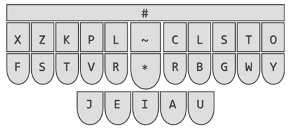
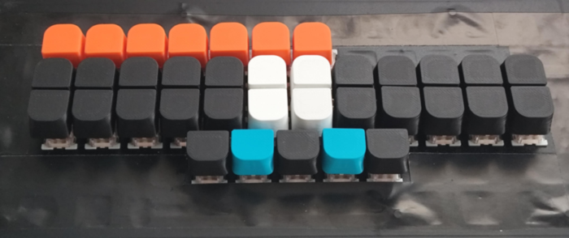

# Steno_PL

Celem pojektu Steno_PL jest publikacja słowników zgodnych z Plover i z wtyczką Slowik, przeznaczonych dla systemu polskiej stenotypii.  
## Aktualnie opublikowane słowniki:
* [Trillo_Exercises_PL](https://github.com/Jamers303/Steno_PL/tree/main/Trillo_Exercises_PL) - słownik obsługujący wszystkie słowa, rdzenie, przedrostki, przyrostki i inne literały użyte w ćwiczeniach zawartych w podręczniku "West Slavic Machine Stenography" autorstwa Priscilli Trillo.

## Co to jest ta stenotypia i co do niej potrzeba?

Czym jest stenotypia (i szerzej: stenografia) możemy dowiedzieć się z serii wpisów na blogu Krzysztofa Smirnowa: [www.stenografia.pl](https://www.stenografia.pl/), który jest nieocenionym apostołem, propagatorem i źródłem wiedzy na ten temat w polskim internecie. Jest również autorem i koordynatorem prac nad wtyczką Slowik do oprogramowania Plover, ale o tym za chwilę.

Gdy już poznamy czym jest stenotypia to pora odpowiedzieć sobie na pytanie - co jest potrzebne do tego, żeby nauczyć się jej i móc ją praktykować. Niezbędnymi składnikami są:
* **klawiatura** stenotypiczna,
* **system** (teoria) sposobu pisania na klawiaturze stenotypicznej w danym języku,
* **oprogramowanie** obsługujące klawiaturę,
* **wtyczka** do tegoż oprogramowania realizująca układ klawiatury zgodny z wybranym systemem,
* **słowniki** jako formalny zapis tłumaczenia akordów wciskane na klawiaturze na słowa, litery i znaki (zgodnie z wytycznymi opisanymi przez system).

Skąd to wszystko wziąć? No to po kolei...

### Klawiatura
Z klawiaturami stenotypicznymi jest ten problem, że kosztują majątek. Dodatkowo nie każda pasuje do każdego systemu. Lepszym rozwiązaniem (przynajmniej na początek przygody ze stenotypią) wydaje się przystosowanie sobie "normalnej" klawiatury mechanicznej. Niestety to musi być klawiatura mechaniczna (tak więc tanie klawiatury za kilkadziesiąt PLN odpadają) ponieważ musi rejestrować wiele naciśniętych klawiszy jednocześnie (tzw. NKRO - N-Key Rollover).
Do takiej klawiatury powinniśmy wydrukować sobie specjalne nakładki "prostujące" układ klawiatury i zbliżające klawisze do siebie. Na sieci można znaleźć gotowe pliki .stl z takim nakładkami, które możemy pobrać i wydrukować na drukarce 3d. Przykładowe model poniżej:
* dla przełączników klawiaturowych typu Cherry MX: [https://cemrajc.github.io/stenotoppers/](https://cemrajc.github.io/stenotoppers/)
* dla przełączników klawiaturowych typu Outemu: [https://aerick.ca/steno/outemu-stenotoppers/](https://aerick.ca/steno/outemu-stenotoppers/)

Później musimy jeszcz pobawić się trochę wyciągając z klawiatury niepotrzebne klawisze, zostawiając te które pasują do układu polskiej klawiatury stenograficznej. Układ ten wygląda następująco:

Jeszcze odrobina zabawy w zaklejanie czarną taśmą dziur po klawiszach, zakładanie nakładek i ostateczznie otrzymujemy coś w tym kształcie:

Wybrałem niesymetryczny układ przycisków numerycznych bo taki mi się podobał :D

### System

### Oprogramowanie

### Wtyczka

### Słowniki

### ...a na koniec - podziękowania
*

