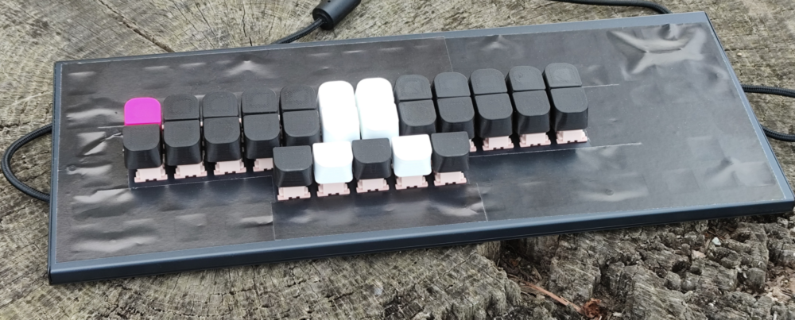

# Steno_PL

Celem pojektu Steno_PL jest publikacja słowników zgodnych z Plover i z wtyczką Slowik, przeznaczonych dla systemu polskiej stenotypii.  
## Aktualnie opublikowane słowniki:
* [Trillo_Exercises_PL](https://github.com/Jamers303/Steno_PL/tree/main/Trillo_Exercises_PL) - słownik obsługujący wszystkie słowa i literały użyte w ćwiczeniach zawartych w podręczniku "West Slavic Machine Stenography" autorstwa Priscilli Trillo
* [Trillo_Letters_PL](https://github.com/Jamers303/Steno_PL/tree/main/Trillo_Letters_PL) - słownik z literami
* [Trillo_PunctFormSpeak_PL](https://github.com/Jamers303/Steno_PL/tree/main/Trillo_PunctFormSpeak_PL) - słownik ze znakami interpunkcyjnymi, formatowaniem i mówcami
* [plvr_commands_PL](https://github.com/Jamers303/Steno_PL/tree/main/plvr_commands_PL) - słownik obsługujący komendy oprogramowania Plover
* [lpwg_numMov_PL](https://github.com/Jamers303/Steno_PL/tree/main/lpwg_numMov_PL) - słownik z cyframi i liczbami oraz umożliwiający ruch kursora

## Co to jest ta stenotypia i co do niej potrzeba?

Czym jest stenotypia (i szerzej: stenografia) możemy dowiedzieć się z serii wpisów na blogu Krzysztofa Smirnowa: [www.stenografia.pl](https://www.stenografia.pl/), który jest nieocenionym apostołem, propagatorem i źródłem wiedzy na ten temat w polskim internecie. Jest również autorem i koordynatorem prac nad wtyczką Slowik do oprogramowania Plover, ale o tym za chwilę.

Gdy już poznamy czym jest stenotypia to pora odpowiedzieć sobie na pytanie - co jest potrzebne do tego, żeby nauczyć się jej i móc ją praktykować. Niezbędnymi składnikami są:
* **klawiatura** stenotypiczna,
* **system** (teoria) sposobu pisania na klawiaturze stenotypicznej w danym języku,
* **oprogramowanie** obsługujące klawiaturę,
* **wtyczka** do tegoż oprogramowania realizująca układ klawiatury zgodny z wybranym systemem,
* **słowniki** jako formalny zapis tłumaczenia akordów wciskane na klawiaturze na słowa, litery i znaki (zgodnie z wytycznymi opisanymi przez system).

Skąd to wszystko wziąć? No to po kolei...

### Klawiatura
Z klawiaturami stenotypicznymi jest ten problem, że kosztują majątek. Dodatkowo nie każda pasuje do każdego systemu. Lepszym rozwiązaniem (przynajmniej na początek przygody ze stenotypią) wydaje się przystosowanie sobie "normalnej" klawiatury mechanicznej. Niestety to musi być klawiatura mechaniczna (tak więc tanie klawiatury za kilkadziesiąt PLN odpadają) ponieważ musi rejestrować wiele naciśniętych klawiszy jednocześnie (tzw. NKRO - N-Key Rollover). Dodatkowo polecam poszukać klawiatury z liniowymi przełącznikami o jak najmniejszej sile nacisku (np. Outemu Peach Silent). 
Do takiej klawiatury powinniśmy wydrukować sobie specjalne nakładki "prostujące" układ klawiatury i zbliżające klawisze do siebie. Na sieci można znaleźć gotowe pliki .stl z takim nakładkami, które możemy pobrać i wydrukować na drukarce 3d (jeżeli nie mamy dostępu do drukarki 3d to możemy zlecić taki wydruk, np. tutaj: [https://drukarex.pl/](https://drukarex.pl/) ). Przykładowe modele poniżej:
* dla przełączników klawiaturowych typu Cherry MX: [https://cemrajc.github.io/stenotoppers/](https://cemrajc.github.io/stenotoppers/)
* dla przełączników klawiaturowych typu Outemu: [https://aerick.ca/steno/outemu-stenotoppers/](https://aerick.ca/steno/outemu-stenotoppers/)

Później musimy jeszcze pobawić się trochę wyciągając z klawiatury niepotrzebne klawisze, zostawiając te które pasują do układu polskiej klawiatury stenograficznej. Układ ten wygląda następująco:

Odrobina zabawy w zaklejanie czarną taśmą/papierem dziur po klawiszach, zakładanie nakładek i ostatecznie otrzymujemy coś w tym kształcie (poniżej wersja z niesymetrycznym układem przycisków numerycznych):

A jak się rozpędzimy to możemy pofantazjować z kolorkami i układem (poniżej wersja bez przycisków numerycznych, z wyróżnionym przyciskiem X - który może również służyć jak przycisk #):

### System
Do niedawna nie mieliśmy polskiego systemu stenotypii ale na szczęście to się zmieniło. Priscilla Trillo wykonała niesamowity ogrom pracy i przygotowała podręcznik z opisem systemu nie tylko dla języka polskiego ale również dla czeskiego i słowackiego! Opis systemu "**West Slavic Machine Stenography**" jest do pobrania [TUTAJ](https://github.com/Plover-Trillo/WestSlavicStenography/releases) całkowicie za darmo. Teraz nie ma już żadnego usprawiedliwienia. Wystarczy "tylko" usiąść do lektury opasłego tomiska i się uczyć.   
Jak to przy takich opracowaniach (zwłaszcza w pierwszych ich wersjach) w treści mogą pojawiać się błędy. Te które udało mi się wyłapać spisuję tutaj: [Errata](https://github.com/Jamers303/Steno_PL/tree/main/Errata)

### Oprogramowanie
Oprogramowanie obsługujące klawiatury stenotypiczne to dobrze znany w środowisku steno **Plover**. Oprogramowanie to jest udostępnione za darmo i należy je ściągnąć i zainstalować na komputerze, na którym będziemy zgłębiać tajniki sztuki stenotypii. Strona domowa projektu Plover jest [TUTAJ](https://www.openstenoproject.org/plover/). 

### Wtyczka
Jak można było przeczytać wcześniej - Krzysztof Smirnow nie tylko dzieli się z wszystkimi swą ogromną wiedzą na temat stenografii i stenotypii ale również stworzył (wspólnie z Markiem Łukasiewiczem) wtyczkę do oprogramowania Plover, obsługującą polski system stenotypii. Wtyczka nazywa się **Slowik** (z powodów podanych w tym [wpisie](https://www.stenografia.pl/blog/2021-08-24_krotko-o-nazwie-projektu/) na blogu stenografia.pl) i należy ją zainstalować zgodnie z instrukcją dostępną [TUTAJ](https://github.com/flamenco108/plover_polish_slowik).

### Słowniki
No i tu mamy pewien problem. Otóż słownika zgodnego z polskim systemem stenotypii... nie ma. Ten dostępny z wtyczką Slowik jest na razie dość pusty. Z wpisów na blogu stenografia.pl możemy dowiedzieć się, że prace nad słownikiem trwają ale nie został określony żaden horyzont czasowy, kiedy taki słownik mógłby się pojawić. Stąd właśnie pomysł na projekt Steno_PL. Żeby nie blokować sobie możliwości nauki polskiej stenotypii zacząłem przygotowywać słownik, który docelowo ma zawierać wszystkie słowa wykorzystane w ćwiczeniach opisanych w podręczniku. Słownik uzupełniam sukcesywnie w trakcie przerabiania kolejnych lekcji z podręcznika, które również przepisuje tutaj do GitHuba. Po szczegóły - odsyłam [TUTAJ](https://github.com/Jamers303/Steno_PL/tree/main/Trillo_Exercises_PL).

### ...a na koniec - podziękowania
Podziękowania dla wszystkich osób, dzięki którym możemy zgłębiać piękną sztukę stenotypii w naszym języku:
* dla Mirabai Knight za ufundowanie oprogramowania Plover,
* dla Priscilli Trillo za podręcznik do polskiej stenotypii,
* dla Krzysztofa Smirnowa za propagowanie idei stenografii i stenotypii w narodzie,
* dla Krzysztofa Smirnowa i Marka Łukasiewicza za wtyczkę Slowik,
* dla wszystkich, którzy nie boją się tematu stenotypii - czyli dla Ciebie drogi czytelniku ;)

Powodzenia w nauce  
Jamers

