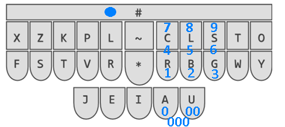

## Słownik cyfr, liczb i przemieszczania kursora

Tutaj znajduje się słownik umożliwiający wprowadzanie liczb i cyfr oraz przemieszczanie kursora.  

### Cyfry i liczby

Rozdział w podręczniku Priscilli Trillo opisujący "wklepywanie" numerków daje czytelnikowi wolną rękę w sprawie 
sposobu uzyskania cyfr na klawiaturze stenotypicznej. Moja propozycja to translacja metody opisanej w systemie [lapwing](https://lapwing.aerick.ca/), zakładającej użycie klawisza "#" lewą ręką, prawa zaś pozostaje w pozycji bazowej i korzysta z klawiszy -C -L -S i -R -B -G jak z bloku numerycznego na zwykłej klawiaturze. Mam nadzieję, że poniższy obrazek wszystko dobrze objaśnia.

Prawy kciuk jestodpowiedzialny za uzyskanie cyfr: 0 (A), 00 (U) lub 000 (AU).  
Klawisze A i U można łączyć z -C -L -S -R -B -G w celu uzyskania gotowych liczb. Np. #AC = 70, #US=900, #AUB=2000.  
Cyfry domyślnie wstawiane są w trybie "zlepiania". W celu pisania oddzielnych cyfr należy oprócz klawisza "#" użyć jeszcze dodatkowo lewego L (jak **L**uzem).  
Jako bonus w tym słowniku zdefiniowane zostało użycie samego klawisza "#" jako powtórzenie ostatniego akordu (działa nie tylko na akordy z tego słownika tylko ogólnie - na wszystkie jakie tylko uda wam się wcisnąć).

| Akord    |  Cyfra/Liczba  | 
|----------|---------| 
| #A       | 0       | 
|    #U    | 00     | 
|   #AU    | 000 |
| #-R      | 1       | 
|  #-B    | 2       | 
|  #-G     | 3 |
| #-CR      | 4       | 
|  #-LB    | 5       | 
|  #-SG     | 6 |
| #-C      | 7       | 
|  #-L   | 8       | 
|  #-S     | 9 |
| #A[-C -L -S -R -B -G] | [1-9]0 |
| #U[-C -L -S -R -B -G] | [1-9]00 |
| #AU[-C -L -S -R -B -G] | [1-9]000 |
| #L[A U -C -L -S -R -B -G] | cyfry/liczby bez trybu "zlepiania"|
| # | powtórzenie ostatniego akordu |

### Przemieszczanie kursora

